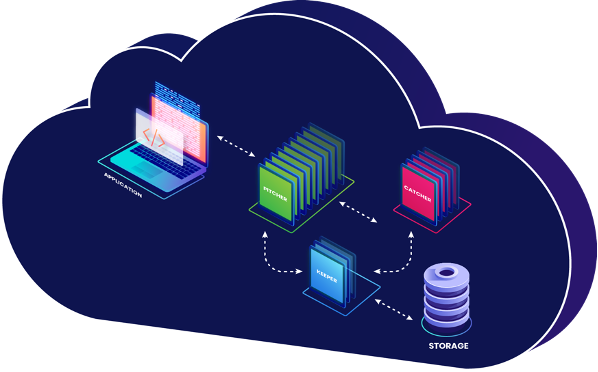
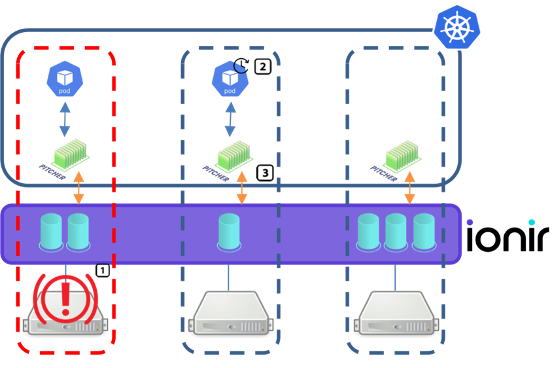

# Introduction

Ionir is a container-native data platform for Kubernetes. Ionir virtualizes all available storage in a Kubernetes cluster to create a single pool of highly scalable storage. Having a Container Storage Interface (CSI) plugin, Ionir storage can be provisioned and managed by Kubernetes, the common control plane in the environment.

In addition to providing resilient, high-performance storage, Ionir also provides end-to-end data management capabilities. The Ionir architecture separates the metadata from the data, which enables unique data management capabilities such as instant clones. The microservices architecture provides a unified data platform that is elastic, scalable, and agile, which is critical for containerized deployments.

### Ionir Pods Architecture

Ionir microservices architecture provides a unified data platform that is elastic, scalable, and agile. Here is a high-level view of the Ionir pods responsible for the I/O flow:

* **Pitcher** - A pitcher provides a standard interface (NVMe/TCP) for applications. A pitcher is created for each node in the cluster and serves all the PVC running on it.
* **Catcher** - Catchers are responsible for metadata and data management functionality.
* **Keeper** - Keepers are the interface to the media.

### Ionir Volume

When an application (pod) requests a persistent volume claim (PVC), the Ionir storage provisioner creates a thin provisioned volume (PV) in the Ionir Storage Pool. All volumes are available from any node in the cluster. An Ionir Pitcher pod is created per node and serves as the interface between the volumes and the application.

If a node fails or a pod (application) is rescheduled to another node, the pitcher will instantly move responsibility to the same node as the pod to allow the application access to the data.

1. Node Failure is detected, either physical or logical.
2. All pods are rescheduled to run on other nodes.
3. Ionir Pitcher takes responsibility on the target node

### Data Resiliency

Ionir data resiliency uses 3-way mirroring which provides protection against two media device failures. In case of a media device failure, the redundant data will be distributed to other media devices in the cluster.


Two media devices failure on different nodes is supported only in clusters with at least five (5) worker nodes with at least one (1) NVMe media in each. This is due to ETCD consensus requirements.


