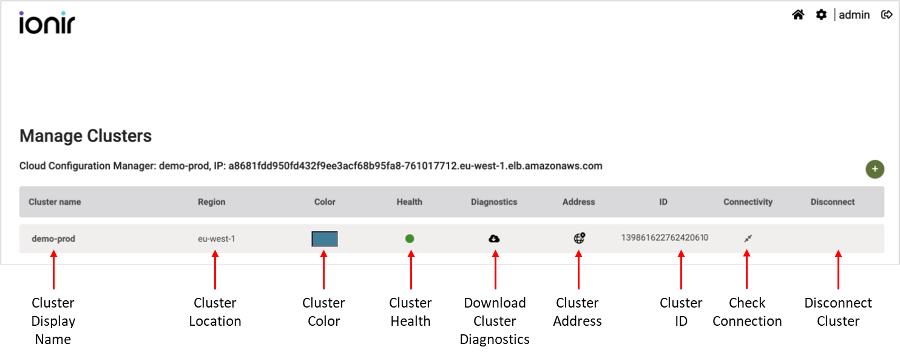
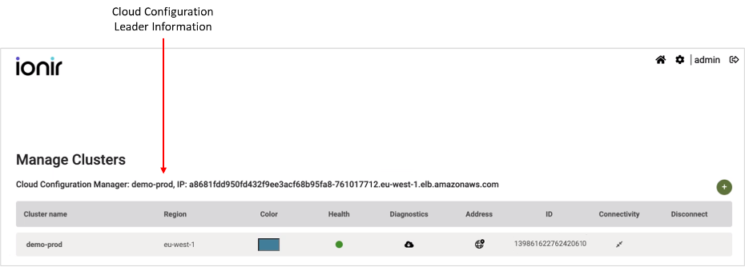

# Ionir Cloud Manager Operations

Ionir Cloud Manager enables the user to view and perform operations at the cloud level. This includes viewing Ionir capacity and connecting/disconnecting clusters.

### Settings

The Manage Clusters \*\*\*\* window is used to view all clusters in the Ionir Cloud Manager. Click the settings icon (.png>)) on the top right to open the “Manage Cluster” window.

* **Cluster name** - Cluster display name. You can modify the cluster display name by clicking on the name and entering a new name.
* **Region** - Cluster region. This information is automatically taken from the cluster definitions (when available).
* **Color** - Cluster display color. You can modify the cluster color by clicking on the color and selecting a new color.
* **Health** - Health status of the cluster.
* **Diagnostics** - \*\*\*\* Download cluster diagnostics.
* **Address** - Used to connect clusters into a single Ionir Cloud Manager.
* **ID** - Cluster ID.
* **Connectivity** - Check connectivity between the source and destination cluster.
* **Disconnect** - Disconnect cluster.

### Creating an Ionir Cloud

Multiple Ionir clusters can be connected into a single Ionir Cloud. Once connected, the clusters are viewed and managed from the same Ionir Cloud Manager, but more importantly, this connectivity enables seamless data mobility between all clusters in the cloud. Up to ten (10) clusters can be connected into a single cloud.

Cross-cluster connectivity is done using an Ingress controller that gets an external IP address from the clusters’ Load Balancer. All nodes in each cluster must be able to connect to the Ingress controller external IP on the other clusters.


To avoid IP address conflicts, make sure the external IP addresses allocated by the external load balancer of the clusters are on a different IP range.


#### Security Configuration

Each Ionir is installed with a local identity provider (IDP) called Keycloak. In order to connect clusters, they must use the same IDP (Keycloak). To change the IDP of the cluster, refer to Changing Identity Provider (IDP).

### Cloud Configuration Leader

Each Cloud has a database that holds some configuration information about all the clusters in that cloud. This database is deployed in a primary/secondary design where only one cluster can update (write) the database and then the information is updated on all other clusters in the cloud. The primary cluster is called the “Cloud Configuration Leader”.


**Note**: The Cloud Configuration Leader doesn’t have to be the IDP provider of the cluster.


#### Identifying the Cloud Configuration Leader

To identify the cluster that is the Cloud Configuration Leader of the cloud, open the Ionir Cloud Manager and click the settings icon (.png>) \_\_ ) to open the Manage Clusters Window. The name of the Cloud Configuration Leader and its IP are displayed above the Manage Clusters table.


Before clusters are connected, each cluster is the Cloud Configuration Leader of its own cloud.


### Connecting Clusters to Cloud

Cluster connection is done using the local Ionir Cloud Manager of the member which you want to connect to an Ionir Cloud (master).

To connect a cluster to the master:

* [ ] Identify the Cloud Configuration Leader and copy its IP.
* [ ] Login to the Ionir Cloud Manager of the cluster that you would like to join to the cloud.
* [ ] On the top right corner, click the settings icon to open the Manage Clusters window.

Click ( ) and enter the information of the Ionir Cloud master/Cloud Configuration Leader.

The Set Master dialog opens:

1. Enter the **Master IP**.
2. Click **ADD**.

.png>)

Once the connection operation completes, the cluster is added to the selected Ionir Cloud and a success message is displayed.

### Disconnecting Clusters from Master

Disconnecting a cluster from the Ionir Cloud removes it from the Ionir Cloud Manager, thereby disabling data mobility operations to and from that cluster to the other clusters remaining in the cloud. Each cluster can only disconnect itself from the Ionir Cloud.

**Important**: The Cloud Configuration Leader cannot be disconnected from the cloud if there are other clusters in the cloud. To remove the cluster that acts as the Cloud Configuration Leader you must first disconnect all other clusters from the cloud.

To disconnect a cluster:

1. Click the settings icon in the navigation bar
2. Click  next to the cluster you want to disconnect.
3. A confirmation window opens. Click **YES** to confirm the disconnect operation.

Once the connection operation completes, the cluster is added to the selected Ionir Cloud and a success message is displayed.\\

.png>)
