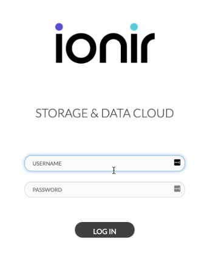
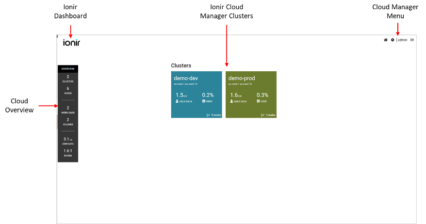
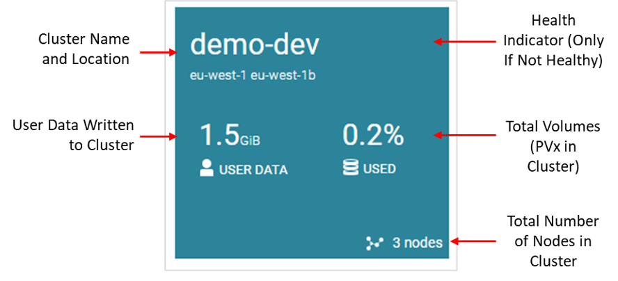

# Working with Ionir Cloud Manager

### Ionir Cloud Manager

Ionir Cloud Manger is a web interface that is used to manage the Ionir clusters. It enables users to view and perform operations both at the cloud and the cluster levels. To manage a cluster - Open the Ionir Cluster Manager by clicking on the cluster in the cloud Dashboard. Ionir Cloud Manager is installed as part of the Ionir cluster installation and can be used to manage all the Ionir clusters that are part of the same Ionir Cloud.


Currently only Chrome v90+ is supported as a browser


#### Finding the Ionir Cloud Manager URL

In order to connect to the Ionir Cloud Manager, the service address of the Ionir Cloud Manager is required.  To find the IP/URL of Ionir Cloud Manager - Go to the Kubernetes CLI and run:

`kubectl -n ionir get svc | grep ionir-nginx-ingress-controller`

The address is the External-IP of the _ionir-nginx-ingress-controller_ service. To login to the Ionir Cloud Manager UI, open a browser and go to the External-IP address of that service.

#### Ionir Cloud Manager Login Page

Ionir uses [OpenID](https://openid.net/connect/) for user identification and authentication. On the first login to the system, the user is prompted to enter user and password In the Ionir Login screen

User credentials are saved as a cookie on the browser and are valid for 12 hours. Users will be prompted to login once the cookie expires.

### Ionir Cloud Manager Main Dashboard

Welcome to Ionir Cloud Manager Dashboard. The following describes the major components and layouts/

The center of the Ionir Cloud Dashboard displays all clusters that are part of the Ionir cloud. For each cluster the following information is available:


Click on a cluster to view and manage the cluster.


#### Monitoring Cluster Health

The Ionir health indicator provides a quick indicator of the overall health of each cluster. The cluster health indicator is shown on each cluster in the Ionir Cloud manager.

The health indicator has three (3) colors:

* **No indication** – The cluster is healthy.
* <mark style="color:yellow;">**Yellow**</mark> – Warning. The cluster has an issue / issues that are not critical. No immediate action is required.
* <mark style="color:red;">**Red**</mark> – Error/Critical. Ionir has an error or the cluster is in a critical state. An immediate user action is required

Refer to Cluster Health section to view the full list of issues that may cause the system to become unhealthy Hovering over a Yellow or Red indicator displays the error or errors that are causing the issue.

