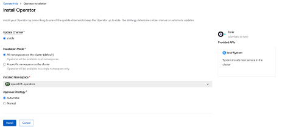
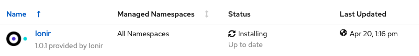
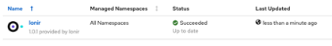
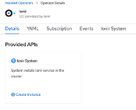
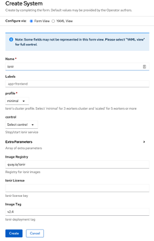
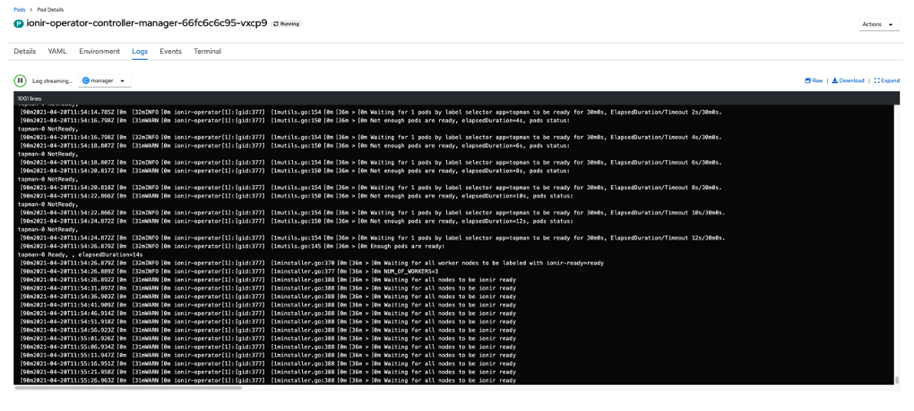
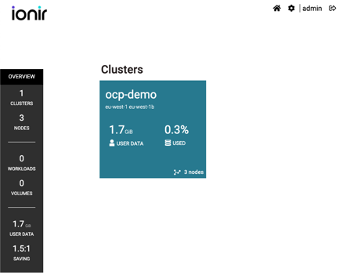

# Ionir on OCP

### Installation Checklist

* [ ] OCP Cluster installed and configured
* [ ] Internet Access to RedHat OperatorHub repository
* [ ] implement machine configs as described in ["Ionir Requirement for OCP” ](../prerequisites/ionir-requirements-on-ocp.md)

### Environment Settings 

The following configurations are recommended to allow smoother rolling upgrades:

* Increase the _ostree-finalize-staged.service_ timeout time from 5m (default) to desired value of 30m.
* Related OCP articles:\
  [https://access.redhat.com/solutions/5304551](https://access.redhat.com/solutions/5304551)\
  [https://access.redhat.com/solutions/5598401](https://access.redhat.com/solutions/5598401)

### Installing Ionir

#### Ionir Operator 

Installed Operators are represented by Cluster Service Versions within this namespace. Ionir Certified Operator can be found on Openshift OperatorHub.

1. Login to Openshit Console
2. Click on “_Operators” -> ”OperatorHub”_
3. Search for _“ionir”_ on the filter box and click the result as follows
4. The following details will appear. Click _“Install”_&#x20;

5\. The following screen will appear please confirm and install with defaults.

6\. You can check the status under _“Installed Operators View”_ \

7\. Wait for “success” to appear in the status column\

#### Install Ionir Instance

After successfully installing the operator and instance of ionir system will be deployed.

1. Select the Ionir operator to display the details.
2. Select _“(+) Create Instance”_

3\. _“Create System”_ form will be displayed

4\. Provide the requested information. Verify _“Image Tag”_ and _“Profile”_ are correct and suit your deployment. Click _“Create”_


**System Name must be “ionir” and cannot be changed.**

**Ionir License is mandatory for a successful deployment.**


Ionir system Install has started. You can monitor the installation status by navigating to the _“Overview”_ section in the console and watching the _“Activity”_ window.

Another option is to go to the _“ionir-operator-controller-manager”_ pod and review the logs, as the following image describes:

### Upgrade Guide

#### Upgrade Ionir Operator 

By default, the operator _“Approval Policy”_ is set to _“Automatic”_. This setting enables Ionir Operator to be upgraded without any customer involvement and effort.

#### Upgrade Ionir System

While the upgrade of the Operator itself is non-intrusive and automatically configured. Upgrading the Ionir System is more complex and disruptive. These are the steps to follow:

1\.     Stop all applications running on Ionir cluster using Ionir resources.

**IO on the system will be disabled from this point until the upgrade completes successfully. No cluster scaling should be done during this process.**

2\.     Update the Ionir System version tag to reflect to new version.

3\.     Allow time for the Ionir Operator to finish the upgrade at reach the desired state.

**This may take significant time and depends on cluster size and performance.**

4\.     Validate Ionir Operator reached “Succeeded” status.

**IO is back online once successfully validated.**

5\.     System is updated and fully operational.

## Ionir Dashboard Login

Ionir utilizes OCP Routes to tunnel the web UI. An OpenShift route is a way to expose a service by giving it an externally reachable hostname like _www.example.com_. A defined route and the endpoints identified by its service can be consumed by a router to provide named connectivity that allows external clients to reach your applications.”

To login to Ionir Cloud Dashboard retrieve it from _“Networking”->”Routes”_ under _“ionir”_ and click the “Location”

