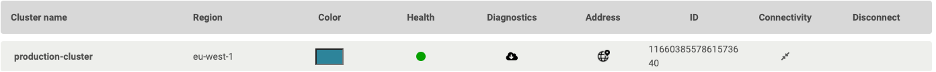
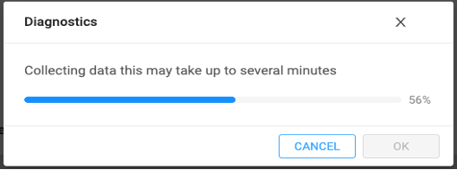
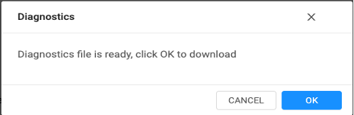

# Contact Support

### Collecting Ionir Logs and Statistics

Ionir logs and statistics can be collected using the Ionir UI.

Open the Ionir Cloud Manager Operations and click the download cluster diagnostics icon next to the cluster. Here you can select the Time Interval for collection (Last 2-48hrs) and logs/metrics options and click “DOWNLOAD”. This will start the collector jobs that will aggregate all information and download it as a zip file to the computer using the browser.

.png>)

You must keep the browser running until the collection process completes and the file is downloaded.

### Contact Support 

For support, please contact your Ionir sales representative, or email [**support@ionir.com**](mailto:support@ionir.com)
