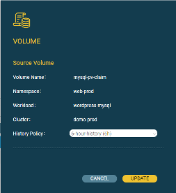

# History Policy

History Policy custom resource definition (CRD) powers the clone to time capability. The History Policy defines the window of time for which Ionir keeps versions of the volume (with 1-second granularity). The volume can then be rolled back to any point in time within that period.

**Note:** The longer the History Policy, the more information is retained, and the more space is required by the backend to maintain the additional copies.

The History Policy is defined when the volume is created from the storageclass. Although storageclasses are immutable, the History Policy of a volume can be changed after creation.

The default is 0 seconds.

To change the History Policy:

1. Open the Volumes view and select the volume.
2. From the context menu next to the volume, select **History Policy**.

The Volume panel opens.

1. Select a History Policy.
2. Click **Update**.

The History Policy of the volume is changed.


The maximum time supported for History Retention is 24hrs. Setting a bigger value will not generate an error.

