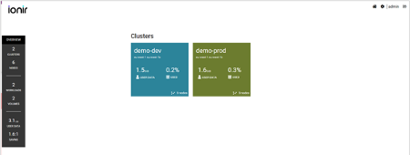
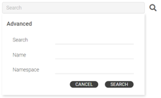

# Ionir Cloud Manager Overview

Ionir Cloud Manager manages one or more clusters. Selecting a cluster in the Cloud Dashboard opens the cluster dashboard.

The top section of the cluster dashboard displays the cluster name and the cluster overview.

### Cluster Management Menu

The Cluster Management tab provides a detailed view of cluster resources, performance, events, and settings.

**Cluster Home** - The Cluster Home screen displays the cluster resource information such as Workloads and Volumes. Different data management operations can be performed on these resources.

For detailed information, refer to the [Cluster Home Screen](ionir-cloud-manager-overview.md#cluster-home-screen) section.

**Statistics** - The Statistics screen displays the cluster performance graphs.

For detailed information, refer to the Statistics Screen section.

**Event** - The Events screens displays the major events that occurred in the cluster.

For detailed information, refer to the Events Screen section.

### Cluster Overview

To expand the cluster overview and see additional cluster information click on User Data or the arrows next to it.

The cluster overview panel provides a detailed view of the cluster usage which include:

**User Data**: Total amount of data stored in the cluster. This is the logical data capacity that does not include any data reduction savings (deduplication and compression).

**Volumes**: Total number of volumes (PV) in the cluster.

**Workloads**: Number of stateful workloads running in the cluster.

**Saving Ratio**: Capacity saving that is achieved by Ionir inline deduplication and compression.

**Cluster Total**: Total storage capacity (total media devices capacity) available in the cluster. The display capacity is calculated based on the data resiliency schema (3-way mirroring in the current version).

**Used**: Physical storage consumed by the user data after data deduplication and compression.

**Nodes**: Total number of nodes in the cluster.

### Cluster Home Screen

The tabs show the cluster resources such as Workloads and Volumes, and the different data management operations that can be performed on these resources.

#### Workloads

Workloads are a list of StatefulSets, Deployments, and Pods that are installed in the cluster. Only stateful workloads that use Ionir’s volumes (PV) are displayed.

Use the search bar to filter the workloads in the view. Click the search icon to open the search box:

**Name** – Search the workload name only. Must be a complete match. Search is case sensitive

**Namespace** – Search the namespace only. Must be a complete match. Search is case sensitive

**Search** – Search all fields of the workload.

Workload tiles display the following information:

Click on the workload to view its volumes.

#### Volumes

Volumes’ page displays the Persistent Volume Claims (PVC) that were created on the cluster using Ionir as the storage provisioner.

To filter the view, Click **All** to view all volumes, click **Claimed** to view only volumes that are mounted by a workload, or click **Unclaimed** to view only unmounted volumes.

Use the "Search bar" to filter the volumes in the view. Click the search icon to open the search box.

To perform operations on a volume, click on the context menu icon next to volume.&#x20;

The operations include:

○      **Clone** – Instant clone of a volume, with an option to clone to time

○      **History Policy** – Change the volume’s History Policy.

○      **View workload** – shows Workloads view of the workload in the context of the selected volume.

○      **View performance -** show the performance view in the context of the selected volume.

○      **View events -** show the events view in the context of the selected volume.
